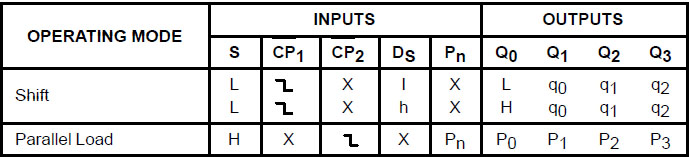

### Theory 

 
                            
 Shift register:&nbsp;A register capable of shifting information either to right or left is called a shift register.In a shift register, the flip-flops are connected in such a way that the binary bits are entered into the shift register,shifted from one location to another and finally shifted out.Different types of shift register:&nbsp;
		  <ul style="list-style:circle">
		  <li>Serial-in-Serial-out(SISO)</li>
		  <li>Serial-in-Parallel-out(SIPO)</li>
		  <li>Parallel-in-Serial-out(PISO)</li>
		  <li>Parallel-in-Parallel-out(PIPO)</li>
		  
</ul>
           
 
  4 Bit Shift Register 

                      
 
							 
                            

                            
							 
							 
							Figure 1:&nbsp;74LS95B(4 bit Shift Register)
							
 
                             
 The SN54/74LS95B is a 4-Bit Shift Register with serial and parallel synchronous operating modes.These operating modes are controlled by a mode control input (S). The serial shift right and parallel load are activated by separate clock inputs which are selected by a mode control input (S). The data is transferred from the serial or parallel D inputs to the Q outputs synchronous with the HIGH to LOW transition of the appropriate clock input.
<ul style="list-style:circle">

<li>Synchronous, Expandable Shift Right</li>
<li> Synchronous Parallel Load</li>
<li> Separate Shift and Load Clock Inputs</li>
</ul>

 <!--
  NOTE 
 The Flatpak version has the
same pinouts (Connection
Diagram) as the Dual In-Line
Package.
CONNECTION DIAGRAM DIP (TOP VIEW)-->
VCC = PIN 14
GND = PIN 7   

  PIN NAMES 

S:&nbsp; Mode Control Input 

DS:&nbsp; Serial Data Input
. 

P0–P3:&nbsp; Parallel Data Inputs 

CP1:&nbsp; Serial Clock (Active LOW Going Edge) Input 

CP2:&nbsp;Parallel Clock (Active LOW Going Edge) Input 

Q0–Q3:&nbsp; Parallel Outputs

<!--
  NOTE 

a. 1 TTL Unit Load (U.L.) = 40 mA HIGH/1.6 mA LOW.

b. The Output LOW drive factor is 2.5 U.L. for Military (54) and 5 U.L. for Commercial (74)
Temperature Ranges.

                        
                             
                             
-->
 <!-- 
 SN54/74LS95B 
-->

                             
                            Figure 2:&nbsp;Logic Diagram of 74LS95B
							

                             
                            
  Functional Description 

    The SN54/74LS95B is a 4-Bit Shift Register with serial and parallel synchronous operating modes. It has a Serial (DS) and four Parallel (P0–P3) Data inputs and four Parallel Data outputs (Q0–Q3). The serial or parallel mode of operation is controlled by a Mode Control input (S) and two Clock Inputs (CP1) and (CP2).When the Mode Control input (S) is HIGH, CP2 is enabled. A HIGH to LOW transition on enabled CP2 directly loads parallel
data from the P0–P3 inputs to the Q0–Q3 outputs. When the Mode Control input (S) is LOW, CP1 is enabled. A HIGH to LOW transition on enabled CP1 transfers the data
from Serial input (DS) to Q0 and shifts the data in Q0 to Q1, Q1 to Q2, and Q2 to Q3 respectively (right-shift). For normal operation, S should only change states when both Clock inputs are LOW. However, changing S from LOW to HIGH while CP2 is HIGH, or changing S from HIGH to LOW while CP1 is HIGH and CP2 is LOW will not cause any changes
on the register outputs.
                          
 
                             
                             
 
 MODE SELECT/TRUTH TABLE 

							  
                             

                             

							 <ul style="list-style:circle">

<li>L=&nbsp;Low voltage level</li>
<li>H=&nbsp;High voltage level</li>
<li>X:&nbsp;Don't care</li>
<li>X:&nbsp;Don't care</li>
<li>l:&nbsp;Low voltage level one set-up prior to the high to low clock transition</li>
<li>h:&nbsp;high voltage level one set-up prior to the high to low clock transition</li>
<li>Pn:&nbsp;Lower case letters indicate the state of referenced input(or output) one set-up time prior to the high to low clock transition</li>
</ul>                            
                        
