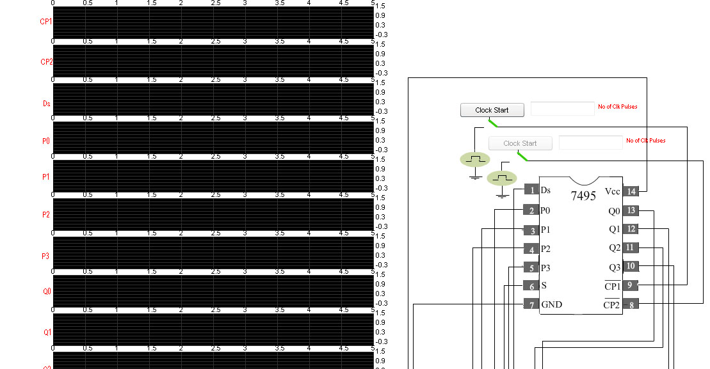
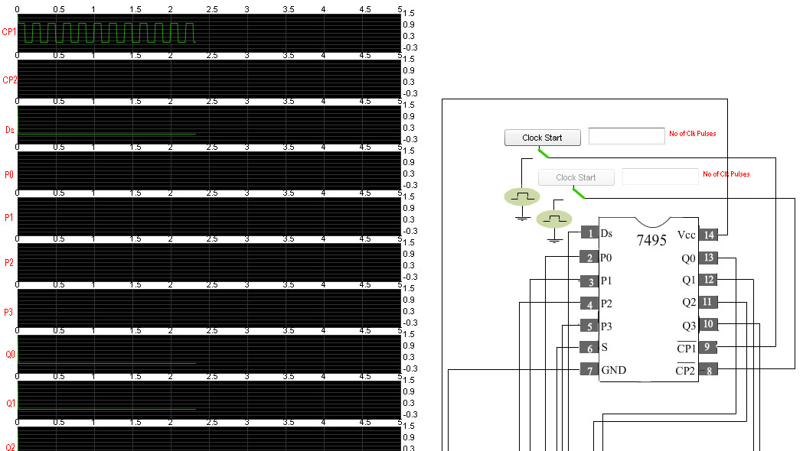
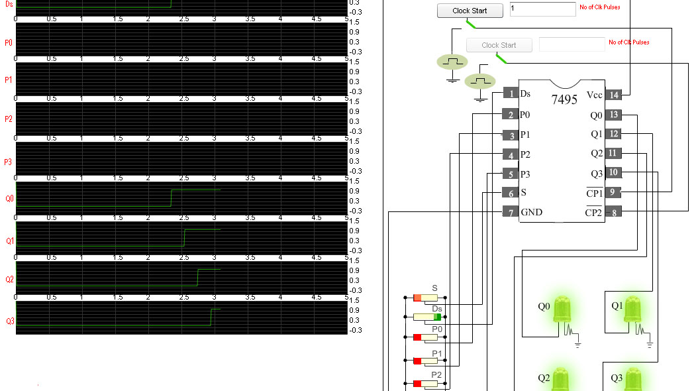
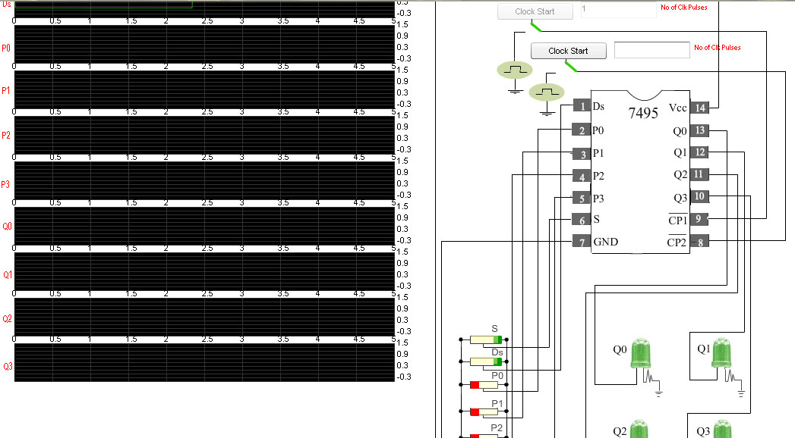
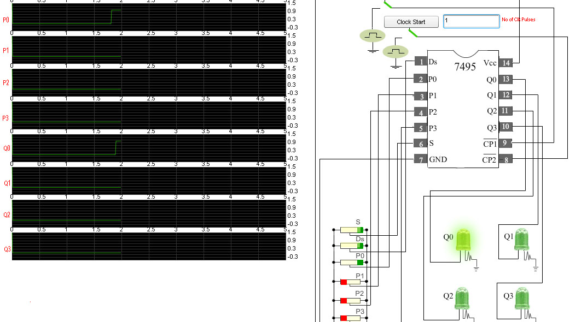
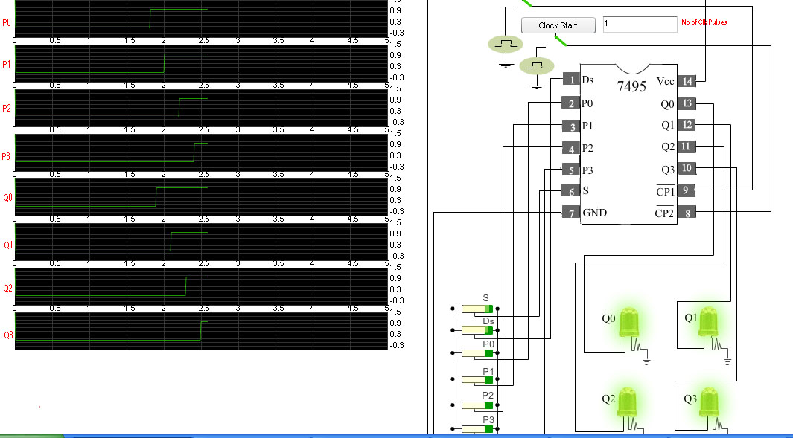

## Procedure

 Please follow these steps to do the experiment.
 
 #### Part 1:
                         
 1.  At first apply high voltage to Vcc.So that the "Clock Start" button
	for the clock pulse(CP1) will be enabled. 
   

                                

                               
2.  Next, apply low voltage to the mode control input (S) and start the clock pulse(CP1).Now the serial input Ds is enabled.The input at Ds will be shifted right to the outputs Q0, Q1, Q2, Q3 at negetive transition of CP1.All the parallel inputs P0, P1, P2, P3  are disabled 

						
3. Now apply high voltage to Ds input and set no of clock pulses to 1.See that the input will be shifted to
	Q0 output at negetive clock edge. 
    

4.  Next, start the clock pulse again.See the input is now shifted to the output Q1.  
    

5.  Again start the clock pulse and see the input is shifted to the output Q2. 

                               
6.  Start the clock pulse again.Now see that at fouth clock pulse input is shifted to the output Q3. 

						
7. Apply high voltage to the mode control input (s).Now the "Clock Start" button for the second clock pulse(CP2) is enabled.Parallel inputs P0, P1, P2, P3 are enabled.These parallel inputs are directly loaded to the outputs Q0, Q1, Q2, Q3 respectively.

                               
                               
8. Start the clock pulse (CP2).After generation of some clock pulses stop the clock by clicking in "Clock Stop" button. 
    

9.  Now apply high voltage to P0 input and set no of clock pulses to 1.See P0  input is directly loaded to the output Q0.

                              
10.  Next, apply high voltage to P1  and start the clock pulse.P1 input is directly loaded to Q1. 

11. Next, apply high voltage to P2  and start the clock pulse.P2 input is directly loaded to Q2. 

                               
12. Now apply high voltage to P3  and start the clock pulse.P3 input is directly loaded to Q3. 

							